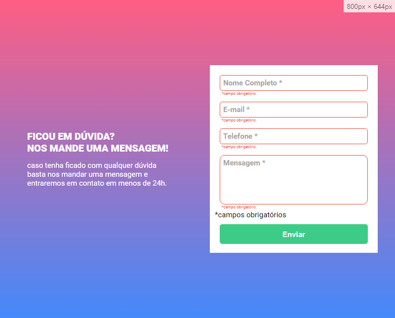
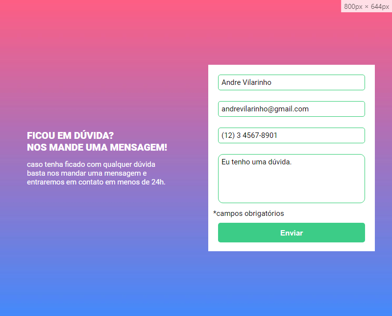

# Projeto Formulário com Validação

- Projeto de um formulário com validação de campos preenchidos feito no curso de Desenvolvimento Web do curso DevQuest do Dev em Dobro.

## ScreenShots

- Screnshot do site

    

- ScreenShot do site com os campos não preenchidos

    

- ScreenShot do site com os campos preenchidos

    

## Tecnologias utilizadas

## Link

- Live Site: <a href="https://teoniuvilarinho.github.io/projeto-formulario" target="_blank">www.projeto-formulário.com</a>